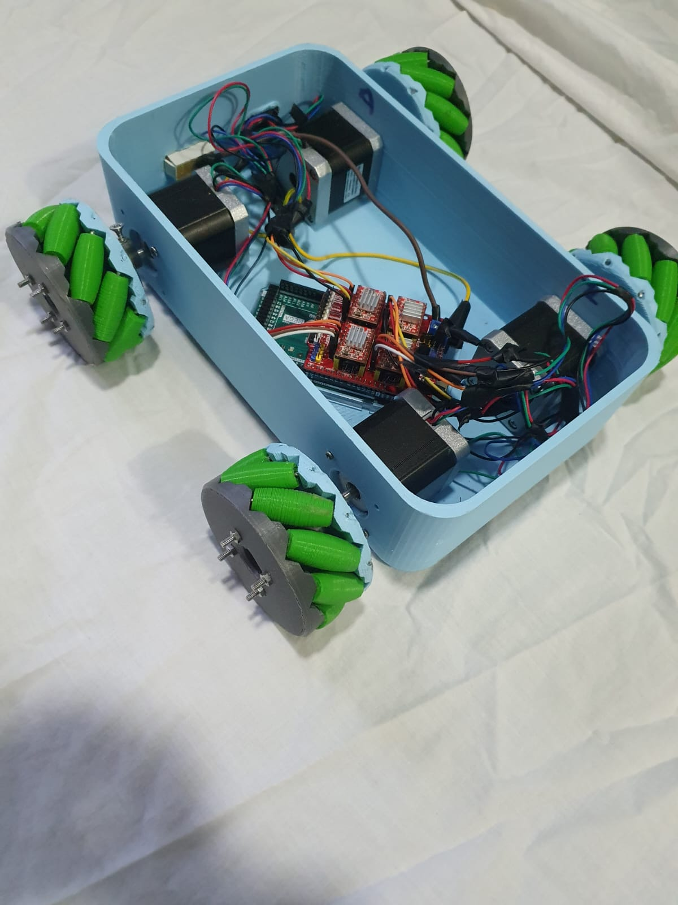
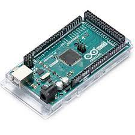
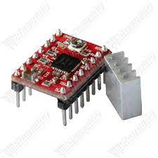
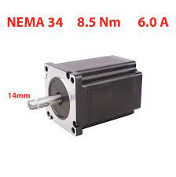

<h1 align="center">RoverBot Project</h1>

   
  RoverBot

<h1 align="center">Abstract</h1>
Our roverbot project is a mobile robot based on mecanum wheels that uses a labyrinth
algorithm to plan the shortest path to reach the destination while avoiding obstacles. The algorithm
uses a matrix to represent the labyrinth, where each cell is numbered based on its distance to
the destination. The destination itself is marked with a "0", adjacent cells are marked with a "1",
cells next to cells marked with "1" are marked with "2" and so on until all cells are filled. Then,
the robot is placed in a random cell and uses this matrix to plan its path while marking each cell
it has passed for mapping. This approach allows the robot to navigate efficiently in complex
environments by using distance information and avoiding obstacles to reach its destination
optimally

<h1 align="center">The Design and Modeling of RoverBot</h1>

<h2 align="center">3D Printing</h2>

In our project, we created the basic structure of our robot using the SolidWorks CAD software. We utilized this software to design the shape of the robot's base and ensure that all parts fit together correctly. For the wheels, we used an existing model of mecanum wheels to ensure a reliable and efficient design.

Next, we employed 3D printing to manufacture all the necessary parts for the wheels in our university laboratory. This allowed us to create precise and high-quality components for our robot, which is crucial for ensuring optimal performance and durability.

By using SolidWorks and 3D printing, we successfully developed a reliable and efficient robot that fulfills all the requirements of our project. We take pride in our creation and look forward to seeing it in action.

The figures below illustrate the machines constructing different pieces of our robot:

<table>
    <tr>
      <td></td>
      <td></td>
      <td></td>
      <td></td>
    </tr>
 
  </table>

<h1 align="center">HARDWARE</h1>

We will use stepper motors, an A4988 driver, and an Arduino Mega board to build a holonomic mobile robot. Stepper motors are electric motors that can be controlled step by step, allowing for extremely precise control. The A4988 driver is a microstepping driver that simplifies the control of stepper motors by integrating a translator for easy use. The Arduino Mega board is a popular development board with enough output pins to connect the stepper motors and sufficient memory to store the control code. By combining these components, we will be able to construct a holonomic mobile robot capable of precise and controlled movements

<h3>Arduino Mega</h3>
An Arduino Mega board can be used to drive 4 stepper motors for a mobile robot as it provides enough output pins to connect all 4 motors. Additionally, it has sufficient memory to store the necessary code for motor control. By using a stepper motor driver like A4988, which can be connected to the Arduino Mega, it becomes easy to control the stepper motors with simple high-level commands. Lastly, the Arduino Mega is a popular platform for robotics projects due to its user-friendliness and a large community of developers.

  

<h3>The A4988 Stepper Motor Driver</h3>
The A4988 is a micro-stepping driver designed to control bipolar stepper motors and features a built-in translator for easy use. This means we can control the stepper motor with just 2 pins from our controller: one for controlling the direction of rotation and the other for controlling the steps. The driver offers five different step resolutions: full step, half-step, quarter-step, eighth-step, and sixteenth-step. Additionally, it includes a potentiometer for adjusting the output current, thermal shutdown protection in case of overheating, and protection against cross-currents.
Its logic voltage ranges from 3 to 5.5V, and the maximum current per phase is 2A if proper additional cooling is provided or 1A of continuous current per phase without a heatsink or cooling.

</td>

<h3>Stepper Motor</h3>
A stepper motor is an electric motor whose main characteristic is that its shaft rotates by taking steps, which means it moves a fixed amount of degrees with each step. This feature is achieved through the internal structure of the motor and allows for knowing the exact angular position of the shaft by simply counting the number of steps taken, without the need for a sensor. This characteristic also makes it suitable for a wide range of applications.

</td>

<h1 align="center">Realization</h1>
<h3>Algorithm explantion</h3>
Our algorithm for this mobile robot project involves using a matrix to represent the maze, where each cell is numbered based on its distance to the destination. The destination itself is marked with "0", adjacent cells are marked with "1", cells next to the "1" marked cells are marked with "2", and so on until all cells are filled. Then, the robot is placed in a random cell and uses this matrix to plan the shortest path to reach the destination while avoiding obstacles, which are defined as cells with high values in the matrix. In our example, we have a 5*5 maze, and we provide the robot with the destination (4,3).

<h3>Code</h3>
n

